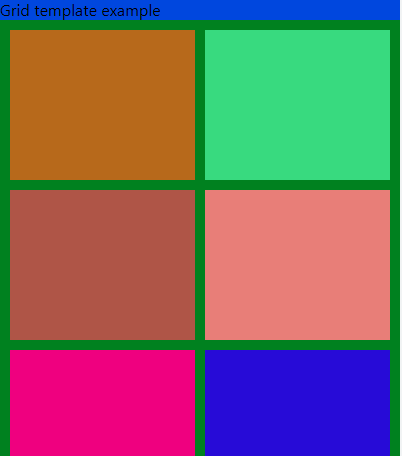
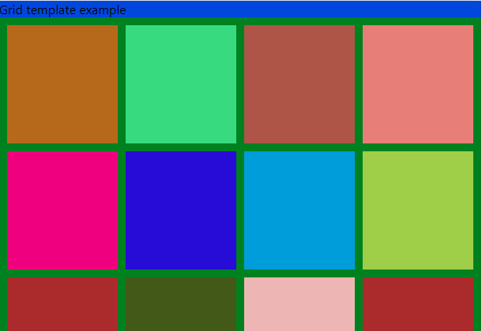

# Description

This project is a simple implementation of using react-grid-layout.
It renders a grid of items on the page, when the page resizes the items in the grid will be pushed onto a newline if they exceed the page width. This was a testbed for a different project but I thought it might be useful.  

Narrow and medium size screen example:  
 

## Current progress

- [x] grid example 
  - [x] moves with breakpoints
  - [x] correct layout for each size
- [x] Jenkins support
- [ ] Docker support  
- [ ] Abstract grid into a utility class with a more simple interface  

## Jenkins CI/CD support
It has Jenkins support, If you have a Jenkins server you can use the Jenkins github plugin to set up a job. It's much easier through blue-ocean. You can create a new pipeline, point it at your github repository and it will automatically build your project.

## Commands

This project was bootstrapped with [Create React App](https://github.com/facebook/create-react-app).

In the project directory, you can run:

### `npm start`

Runs the app in the development mode.\
Open [http://localhost:3000](http://localhost:3000) to view it in the browser.

The page will reload if you make edits.\
You will also see any lint errors in the console.

### `npm test`

Launches the test runner in the interactive watch mode.\
See the section about [running tests](https://facebook.github.io/create-react-app/docs/running-tests) for more information.

### `npm run build`

Builds the app for production to the `build` folder.\
It correctly bundles React in production mode and optimizes the build for the best performance.

The build is minified and the filenames include the hashes.\
Your app is ready to be deployed!
